# AAPG-ANR-2027.github.io
Dynamic stack graph for better understanding of a free , limitless deployement made possible in the healthcare french context
-------------------------------------------------------------------------------------------------------------------------------
# Architecture cible — les 26 briques techniques

*Candidature ANR AAPG 2027 — Oncopole Claudius Regaud / Intellitech / InterSystems — consortium living lab*

---

## Schéma des 9 zones fonctionnelles

```mermaid
flowchart TB
    subgraph F["🔷 Sources complémentaires"]
        direction TB
        F15["15. Exposome &amp; objets connectés à domicile"]
        F16["16. Séries temporelles haute fréquence"]
        F19["19. OSINT en complément des capteurs de santé"]
    end

    subgraph A["🟧 Couches &amp; interopérabilité"]
        direction TB
        A1["1. Couches médaillon bronze / argent / or"]
        A2["2. Façade FHIR &amp; modèle pivot OMOP CDM"]
    end

    subgraph C["🟪 Traitement IA &amp; sémantique"]
        direction TB
        C11["11. Texte libre : regex + LLM en cascade"]
        C12["12. Catalogue / graphe de connaissances / ontologie"]
        C17["17. Modèles explicables non neuronaux"]
        C21["21. Chaîne RAG donnée non structurée"]
    end

    subgraph D["🟩 Gouvernance &amp; qualité"]
        direction TB
        D3["3. Gouvernance transverse"]
        D6["6. Qualité / réconciliation"]
        D23["23. Versionnement systématique"]
    end

    subgraph E["🟥 Supervision &amp; alerting"]
        direction TB
        E4["4. Boucle supervision — retour médecin"]
        E5["5. Boucle supervision — détection d'anomalies"]
        E7["7. Hiérarchisation et routage de l'alerting"]
        E22["22. Boucle retour système source"]
    end

    subgraph G["🟨 Restitution clinique"]
        direction TB
        G18["18. Frise chronologique patient"]
        G20["20. Tableaux de bord à trois échelles"]
    end

    subgraph B["🟦 Infrastructure &amp; orchestration"]
        direction TB
        B8["8. Stack conteneurisée (Docker / Kubernetes)"]
        B9["9. Chiffrement &amp; gestion fine des accès"]
        B10["10. Orchestration Airflow &amp; transformation DBT"]
        B13["13. Tests de bout en bout"]
        B14["14. Scalabilité et dimensionnement"]
    end

    subgraph H["🟪 Conformité continue"]
        direction TB
        H25["25. Surface d'exposition &amp; tests d'intrusion"]
        H26["26. Conformité réglementaire (HDS, AI Act, RGPD, AIPD)"]
    end

    subgraph I["🟫 Impact &amp; valeur"]
        direction TB
        I24["24. Recherche clinique auto-implantée"]
    end

    F -->|ingestion| A
    A -->|transformation| C
    C -->|restitution| G
    G -.->|alertes| E
    E -.->|réinjection| A
    D -.->|gouverne| A
    B -.->|socle technique| D
    H -.->|audite| B
    I -.->|mesure| G

    classDef orange fill:#FFB575,stroke:#CC7830,color:#542700
    classDef cyan fill:#81E7DE,stroke:#259D92,color:#0E4343
    classDef purple fill:#B8ACFB,stroke:#8A7BE0,color:#231266
    classDef green fill:#B3E65F,stroke:#6E9A24,color:#2F440B
    classDef pink fill:#FD9AE7,stroke:#D756BA,color:#511341
    classDef yellow fill:#FFE86D,stroke:#A28E26,color:#574900
    classDef blue fill:#9CE6FF,stroke:#2C97BB,color:#1C4657
    classDef mauve fill:#EEAFFF,stroke:#AC7ABA,color:#531A61
    classDef brown fill:#E1B299,stroke:#AA8570,color:#48230D

    class F15,F16,F19 cyan
    class A1,A2 orange
    class C11,C12,C17,C21 purple
    class D3,D6,D23 green
    class E4,E5,E7,E22 pink
    class G18,G20 yellow
    class B8,B9,B10,B13,B14 blue
    class H25,H26 mauve
    class I24 brown
```

> Traits pleins : flux principal de la donnée (ingestion → transformation → restitution).
> Traits pointillés : boucles de rétroaction et fonctions transverses (supervision, gouvernance, infrastructure, conformité, impact).

---

## Détail des 26 briques par zone

### 🟧 Couches & interopérabilité

| # | Brique |
|---|--------|
| 1 | Couches médaillon bronze / argent / or |
| 2 | Façade FHIR & modèle pivot OMOP CDM |

### 🔷 Sources complémentaires

| # | Brique |
|---|--------|
| 15 | Exposome & objets connectés à domicile |
| 16 | Séries temporelles haute fréquence (monitorage continu) |
| 19 | OSINT en complément des capteurs de santé mobile |

### 🟪 Traitement IA & sémantique

| # | Brique |
|---|--------|
| 11 | Traitement texte libre : regex + LLM en cascade |
| 12 | Catalogue de données, graphe de connaissances, ontologie |
| 17 | Modèles explicables non neuronaux (logique floue) |
| 21 | Chaîne RAG pour la donnée non structurée |

### 🟩 Gouvernance & qualité

| # | Brique |
|---|--------|
| 3 | Gouvernance transverse (identité, sémantique, consentement) |
| 6 | Qualité, réconciliation, cycle de vie de la donnée |
| 23 | Versionnement systématique (reproductibilité) |

### 🟥 Supervision & alerting

| # | Brique |
|---|--------|
| 4 | Boucle de supervision — retour médecin |
| 5 | Boucle de supervision — détection d'anomalies |
| 7 | Hiérarchisation et routage de l'alerting |
| 22 | Boucle de retour vers le système source |

### 🟨 Restitution clinique

| # | Brique |
|---|--------|
| 18 | Frise chronologique patient |
| 20 | Tableaux de bord à trois échelles |

### 🟦 Infrastructure & orchestration

| # | Brique |
|---|--------|
| 8 | Stack conteneurisée (Docker / Kubernetes) |
| 9 | Chiffrement & gestion fine des accès |
| 10 | Orchestration Airflow & transformation DBT |
| 13 | Tests de bout en bout sur données synthétiques |
| 14 | Scalabilité et dimensionnement |

### 🟪 Conformité continue

| # | Brique |
|---|--------|
| 25 | Surface d'exposition & tests d'intrusion |
| 26 | Conformité réglementaire (HDS, AI Act, RGPD, AIPD) |

### 🟫 Impact & valeur

| # | Brique |
|---|--------|
| 24 | Recherche clinique auto-implantée (mesure d'impact) |

---

## Logique des flux entre zones

1. Les **sources complémentaires** (exposome, objets connectés, séries temporelles, OSINT) alimentent les **couches médaillon** en ingestion.
2. Les **couches médaillon** et la façade FHIR/OMOP CDM transforment la donnée vers le **traitement IA et sémantique**.
3. Le **traitement IA et sémantique** restitue vers la **restitution clinique** (tableaux de bord, frise chronologique).
4. La **restitution clinique** route les alertes vers les **boucles de supervision**, qui réinjectent leurs validations dans les **couches médaillon**.
5. La **gouvernance et la qualité** encadrent en amont l'ensemble des couches médaillon.
6. L'**infrastructure et l'orchestration** forment le socle technique de la gouvernance et de la qualité.
7. La **conformité continue** audite en permanence l'infrastructure et l'orchestration.
8. La **recherche clinique auto-implantée** mesure l'impact produit par la restitution clinique.

---

*Schéma d'architecture complet — candidature ANR AAPG 2027 — document de cadrage interne, Oncopole Claudius Regaud.*
